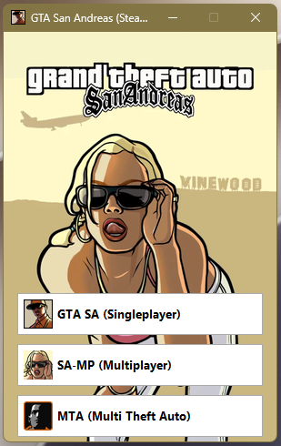

<div align="center">

# 🎮 GTA San Andreas Launcher

**All-in-one launcher for GTA San Andreas: Single-player, SA-MP and MTA in one place.**

[](https://github.com/jose-barroso/gta-sa-launcher/releases)
[](LICENSE)
[](https://github.com/jose-barroso/gta-sa-launcher/releases)

</div>

---

## 📸 Preview

[](img/screenshot.png)

---

## ✨ Features

| Feature | Description |
|---------|-------------|
| 🎯 Single-player | Launch the original GTA San Andreas story mode |
| 🌐 SA-MP | Launch San Andreas Multiplayer |
| 🎮 MTA | Launch Multi Theft Auto |
| 🖥️ Steam Overlay | Keeps the Steam overlay working with SA-MP |
| 📦 Portable | No installation required — just run the `.exe` |
| 🐍 No Python needed | Everything is bundled into a standalone executable |

---

## 🚀 Download & Run

**No Python required.**

1. Go to the [Releases page](https://github.com/jose-barroso/gta-sa-launcher/releases/latest)
2. Download the latest `GTA-SA-Launcher-vX.X.X.zip`
3. Extract it anywhere
4. Run `GTA-SA-Launcher.exe`

> **Windows SmartScreen warning?** Click "More info" → "Run anyway". The exe isn't code-signed, so Windows may flag it the first time.

---

## 🛠️ Building from Source

If you want to build the executable yourself:

```bash
git clone https://github.com/jose-barroso/gta-sa-launcher.git
cd gta-sa-launcher
compile.bat
```

The build script uses a bundled portable Python, so **no Python installation is needed** on your machine.

<details>
<summary>📁 Project structure</summary>

```
gta-sa-launcher/
├── gta-sa.py              # Main application
├── compile.bat            # Build script
├── img/                   # Icons and images
│   ├── bg.webp
│   ├── icon.ico
│   ├── mta.png
│   ├── samp.png
│   └── sp.png
├── python-portable/       # Bundled Python (for building)
└── dist/                  # Output folder (after build)
    └── GTA-SA-Launcher.exe
```

</details>

---

## 📋 Requirements

### Running the launcher
- Windows 10 or newer (64-bit)
- GTA San Andreas installed

### Building from source
- Windows 10 or newer (64-bit)
- Internet connection (only on the first build, to fetch Python packages)

---

## 🧰 Tech Stack

| Layer | Technology |
|-------|------------|
| Language | Python 3.14 |
| GUI | Tkinter |
| Image handling | Pillow |
| System info | psutil |
| Windows API | pywin32 |
| Packaging | PyInstaller |

---

## 🗺️ Roadmap

- [x] Single-player launcher
- [x] SA-MP support
- [x] MTA support
- [x] Steam overlay compatibility
- [x] Portable build (no Python required)

---

## 🤝 Contributing

Contributions, issues, and feature requests are welcome. Feel free to open an [issue](https://github.com/jose-barroso/gta-sa-launcher/issues) or submit a Pull Request.

---

## 📄 License

Distributed under the MIT License. See [LICENSE](LICENSE) for details.

---

<div align="center">

**Made with ❤️ for the GTA SA community**

</div>